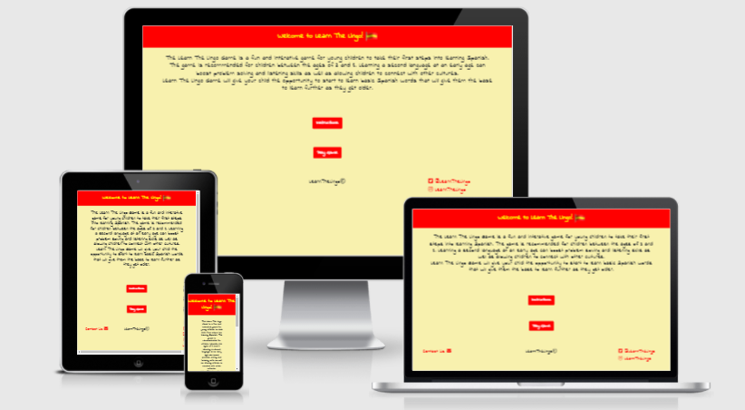

# Learn the Lingo Web based game

#### A link to the site can be found [here.](https://marcjph.github.io/Milestone-Project-2/)

#### Interactive Front End Development - Code Institute

## Table of Contents
1. [Introduction](#introduction)
2. [User Experience](#user-experience)
3. [Wireframes](#wireframes)
4. [Features](#features)
5. [Testing](#testing)
6. [Deployment](#deployment)
7. [Credits](#credits)

### Introduction
#### Learn the Lingo is a fun and interactive website aimed at young children between the ages of 3 and 8 to take their first steps into learning Spanish. The site will be straight forward to navigate but be bright and engaging for the children to play.

### User Experience

The aim of the website it to make it fun for the child so they want to return and play again but also to ensure that they are able to learn their first words in Spanish and are able to retain the information. The site will be have 2 main pages but these will be simple in design and will not contain too much detail to ensure the child is not overburdened with information. The use of bright colours will help achieve the playful aspect of the website.

User Stories to help achieve this user experience:

Player:

1. As a player of the game, I want to be able to navigate around the website easily.
2. As a player of the game, I want to find out how to play the game.
3. As a player of the game, I want to be able to understand the question clearly.
4. As a player of the game, I want to know my score.
5. As a player of the game, I want to know if I got the answer correct or not.

Site Creator:

1. As the creator of the game, I want players to find the website easy and fun to use.
2. As the creator of the game, I want good colours and visuals for the users to enjoy.
3. As the creator of the game, I want users to be able to contact me and provide their feedback.

Parents:

1. As a parent of a child playing the game, I want the site to be simple but intuitive to use.
2. As a parent of a child playing the game, I want the site to be engaging so my child wants to continue to play and learn.
3. As a parent of a child playing the game, I want the site to be playable on different devices so my child can play the game in different environments.

### Wireframes

 - [Index Page](wireframes/index_page.png)
 - [Game Page](wireframes/game_page.png)
 - [Instructions Modal](wireframes/instructions_modal.png)

### Features

Existing features:

 - The main heading contains a **Spain flag gif** that has the flag waving to grab the players attention.
 - The **colours of the Spanish flag** were used heavily through the website as research shows that red can create excitement and encourage creativity while yellow can create a positive feeling and is the optimum colour for maintaining attention.
 - There are **two big red buttons** for the player to select from, keeping the page simple to navigate for the age of the child that the game is intended for.
 - There is the **Contact Us** link at the footer that is easily visible for users to get in contact.
 - The Contact Us form is simple to complete and provides a **notification to the user** that their form has been sent.
 - The question answer **buttons are big and colourful** to grab the players attention but also making them easy to select.
 - The **Check Score** button is also big but uses a different colour to ensure the player understands this button has a different function.

Features left to implement:

 - The use of images to bring more visuals for the player. These would be available for each question and be a guide to the player what the answer may be.
 - The addition of sounds to bring more life to the game.
 - A leaderboard to store the players score and allow them to compare to others.
 - The correct answer in the alert message when player selects the wrong answer.
 - A notification of the questions and the correct answers once player has finished the quiz.

#### Technologies Used

* HTML5
* CSS
* [EmailJS](https://www.emailjs.com/docs/sdk/installation/)
    * EmailJS is used to capture what is provided in the contact form and send this information to the site admin.
* Javascript    
* [Bootstrap 4.6](https://getbootstrap.com/docs/4.6/getting-started/download/)
    * The project uses Bootstrap 4.6 to aid the structure and the responsiveness of the site. 
* [Fontawesome](https://fontawesome.com/)
    * Fontawesome is used to provide the icons that are displayed throughout.
* [Jquery](https://jquery.com/)
    * Jquery is used for the Javascript elements used within the project.
* [Popper.js](https://popper.js.org/)
    * Popper.js was used to reference Javascript.
* [SweetAlert2](https://sweetalert2.github.io/)
    * SweetAlert2 is used to provide a more engaging alert message.

### Testing

The following testing was performed to test functionality, browser compatibility, responsiveness and that the user stories documented above are fulfilled by the completed site.

#### Functionality

Test | Action | Expected Outcome | Test Outcome |
---- | ------ | ---------------- | ------------ |
Instructions button | Select the Instructions button on Index.html page. | A window will pop up explaining how the game should be played. | PASS
Play Game button | Select the Play Game button on Index.html page. | Player is taken to the page where they can start playing the game with questions and answer options being available. | PASS
Contact Us link | Select the Contact Us link on both html pages. | A form is displayed allowing user to enter their details and submit their feedback. | PASS
Form Validation - Contact Us | Enter incorrect values in form | The form would notify that incorrect values were entered and form cannot be submitted | PASS
Social Media links | Select the social media icons/links. | A new tab is opened with the selected social media home page showing. | PASS
Home icon | Select the home icon on the game_page.html page. | User is taken to the index.html page. | PASS
Multiple choice answer buttons | Select one of answer option buttons below the respective question. | A notification will appear advising if answer selected was correct. The answered question should then dissapear from view. | PASS
Check Your Score button | Select the Check Your Score button on the game_page.html page. | A notification would appear advising of the players score. | PASS
Hovering over links and buttons | Hover over links and buttons on both html pages. | When hovering over these elements, they should change colour or change visually. | PASS
Random list of questions on Play Button | Select the Play Game button on the Index.html page. | When selecting the button numerous times, a different list of 10 questions is produced. | PASS

#### Browser Capability

The website and functionality has been tested on the following devices:
 - Iphone 6s
 - Ipad 5th Generation
 - Iphone 12
 - Samsung Galaxy A20

The website and functionality has been tested on the following browsers:
 - Chrome (version 88.0.4324.190)
 - Edge (version 88.0.705.81)
 - Safari (version 14.4.1)

#### Performance

Performance of the website was tested using the Lighthouse function as part of Google developer tools. It was tested for desktop and mobile performance. Test output below.

 - [Lighthouse Test Desktop](testing/desktop_performance_test.png)
 - [Lighthouse Test Mobile](testing/mobile_performance_test.png)

The results were good for the desktop however the mobile performance could be better and requires to be improved.
There was a high score for accessibility in both the desktop and mobile tests however Best Practices and SEO need to be addressed to get a similar high score.

#### Code Validation

The HTML, CSS and Javascript were validated by using the different tools below.

[HTML Validator](https://validator.w3.org/) - The [results](testing/html_validator_results.png) were reviewed and response below:
1. Validated on EmailJS installation docs and code required.
2. Not an issue.
3. Not an issue.
4. Due to design and lay out, no header is required.
5. Not an issue.
6. Not an issue.
7. Not an issue.

[CSS Validator](https://jigsaw.w3.org/css-validator/) - The [results](testing/css_validator_results.png) were review and response below:
1. Reviewed property elements highlighted and not used within project. No issues.
2. Reviewed request and font is pulling through and being used in HTML pages as required.

[JS Hint](https://jshint.com/) - This was used to review the Javascript code. Some missing semi colons were found and corrected. It identified 3 undefined variables which are still under investigation but do not seem to be impacting the functionality of the website. Screen shot of these can be found [here](testing/jshint.png).

#### Responsiveness

The website and the game user experiance is functioning well across the different screen sizes for the different devices. As well as using the options within Google Lighthouse, [Responsinator](http://www.responsinator.com/) was also used to test how the site would look and feel on the different sceen sizes. Landscape and portrait were tested with the social media links being a slight concern in that horizontal scrolling was required for them to be fully visible. This could be amended in the next iteration of the game.

 - [Responsinator Android Device](testing/responsinator_android.png)
 - [Responsinator Ipad Device](testing/responsinator_ipad.png)

#### User Stories Test

To ensure the website met the expectations set by the users and stakeholders listed previously, testing was performed against their criteria.

##### Player:

The player can in a couple of clicks find out how to play the game and then be in the game page ready to play. The game will clearly advise them if they answered the question correctly or not and gives them their score at the end.

##### Site Creator:

The contact functionality allows any parent of a child playing the game to provide any feedback which the creator can access easily. The site is easy to navigate around and is bright and colourful to engage with it's young players.

##### Parents:

As mentioned, the game is simple to use however the colours and big buttons help create a fun activity to keep the child entertained while learning. The website interacts well with all different devices as required.

#### Defects Found during testing:

1. An email was not being received when the user submitted the form on the Contact Us link.
 - It was found that the function for EmailJS was not stated correctly in the head section.

2. Footer elements looked disorganised when site was used on a mobile device.
 - Media query used to align elements centrally.

3. Email being received from site did not contain the information added in form.
 - Name type was added into the input element and then used within the Javascript function to pull the information and use within the email.

### Deployment

This project was developed using GitPod where it is hosted using GitHub pages.

The website was deployed to GitHub pages via the below procedure:

1. Log into **GitHub**.
2. Locate and select the repository named [MarcJPH/Milestone-Project-2](https://github.com/MarcJPH/Milestone-Project-2).
3. Near the top of the page select the **Settings** menu option.
4. On the menu list on the left hand side of the page, select the **Pages** option, which is the second last option in the menu.
5. Under Source, change the drop-down menu where None is labelled to **Master** and select the save button.
6. This deploys the website and creates a link for the website in the GitHub pages section.

The website will automatically update when commits and push's to the master branch are performed. The steps that are required for this to happen are:

1. Within **GitPod**, if the terminal window is not open at the bottom of the page, select Terminal in the top menu and select New Terminal.
2. Actions and instructions can be typed within the terminal at the bottom of the page, where it states gitpod /workspace/"nameofproject" $.
3. To commit changes or additions to the code made within GitPod, type **'git commit -m "add comment in here of what has been changed."'** then Enter.
4. To push the changes so they are sent to GitHub Pages automatically, in the next line in the terminal type **'git push'**. The terminal will run and push the code. If any errors or issues have arose, they will be stated in the terminal message after your command.

### Credits

#### Media
 - The Spain flag gif is taken from [Best Animations](https://bestanimations.com/gifs).

#### Code
 - Adding a link to a button code was sourced from [W3Docs](https://www.w3docs.com/snippets/html/how-to-create-an-html-button-that-acts-like-a-link.html).
 - The code for closing a modal after submitting the form inside was sourced from [Tutorial Republic](https://www.tutorialrepublic.com/faq/how-to-close-a-bootstrap-modal-window-using-jquery.php).
 - The code to take 10 questions from the array randomnly was sourced from [Tutorialspoint](https://www.tutorialspoint.com/select-random-values-from-an-array-in-javascript).

#### Colour Scheme
 - The basis for the colour scheme and how it influences behaviour was taken from [Kaplan](https://www.kaplanco.com/ii/using-color-to-enhance-learning), an early learning company.

 ##### Disclaimer
The content of this Website is for educational purposes only.